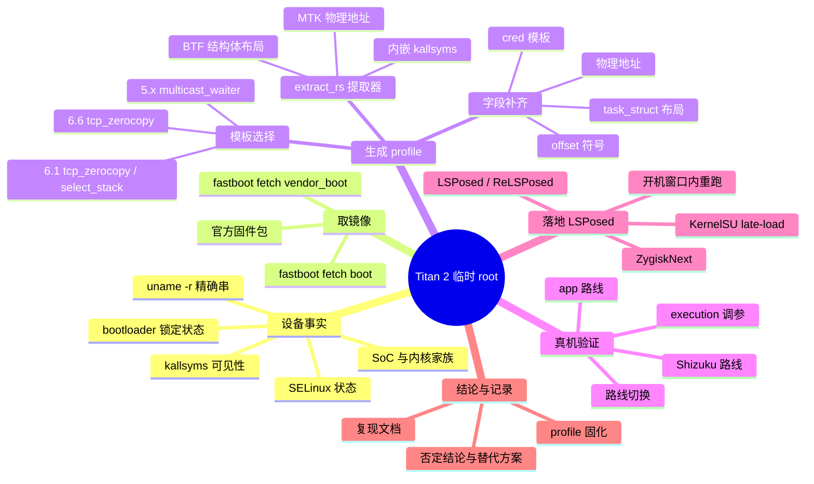

# Feature mindmap

```mermaid
mindmap
  root((Titan 2 临时 root))
    设备事实
      uname -r 精确串
      SoC 与内核家族
      bootloader 锁定状态
      SELinux 状态
      kallsyms 可见性
    取镜像
      fastboot fetch boot
      fastboot fetch vendor_boot
      官方固件包
    生成 profile
      extract_rs 提取器
        内嵌 kallsyms
        BTF 结构体布局
        MTK 物理地址
      模板选择
        5.x multicast_waiter
        6.1 tcp_zerocopy / select_stack
        6.6 tcp_zerocopy
      字段补齐
        offset 符号
        task_struct 布局
        cred 模板
        物理地址
    真机验证
      app 路线
      Shizuku 路线
      路线切换
      execution 调参
    落地 LSPosed
      KernelSU late-load
      ZygiskNext
      LSPosed / ReLSPosed
      开机窗口内重跑
    结论与记录
      profile 固化
      复现文档
      否定结论与替代方案
```
